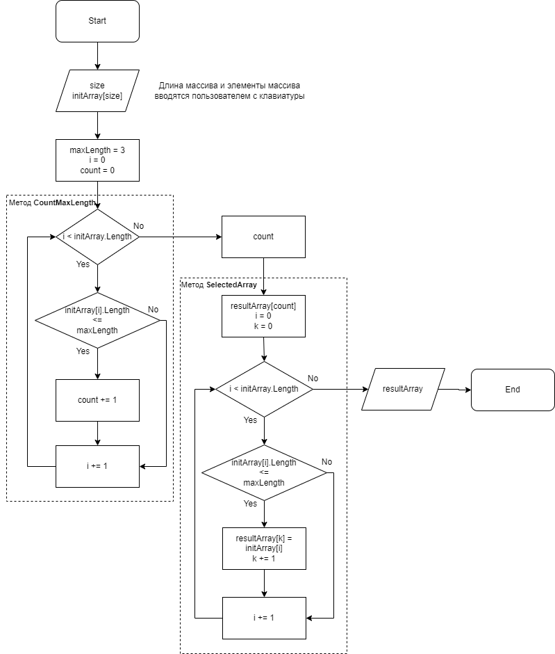

# Контрольная работа

## Условие задачи
Написать программу, которая из имеющегося массива строк формирует массив из строк, длина которых меньше либо равна 3 символа.  
Первоначальный массив можно ввести с клавиатуры, либо задать на старте выполнения алгоритма.  
При решении не рекомендуется пользоваться коллекциями, лучше обойтись исключительно массивами.

## Общие пояснения
В качестве языка программирования выбран C#.  
Задача решена с помощью массивов типа string.

## Решение задачи

### Алгоритм решения
Алгоритм решения показан на диаграмме ниже:  

Решение состоит из 4-х этапов:  
**Этап 1** - ввод данных пользователем  
**Этап 2** - определение количества элементов массива, удолетворяющих требованию (длина не должна превышать 3 символа)  
**Этап 3** - создание результирующего массива, включающего элементы исходного массива, длина которых не превышает 3 символа  
**Этап 4** - вывод результата в консоль

### Этап 1. Ввод данных пользователем
* Первоначальный массив вводится пользователем с клавиатуры.  
Программа сначала предлагает пользователю ввести, сколько элементов будет в массиве:
    - Ожидаемое значение - целое, положительное число (тип *int*)  

Затем пользователю предлагается ввести сами элементы массива.  
Для ввода элементов массива используется метод **CreateStringArray**.
* Параметры метода:
    - *int* **size** - количество элементов в создаваемом массиве типа *string*
* Возвращаемое значение:
    - *string[]* **arr** - массив типа *string*

### Этап 2. Определение количества элементов массива, удолетворяющих требованию (длина не должна превышать 3 символа)
Вычисление выполняется в методе **CountMaxLength**  
* Параметры: 
    - *string[]* **array** - исходный массив
    - *int* **maxStringLength** - максимальное количество символов в элементе массива - критерий, по которому выполняется подсчет
* Возвращаемое значение:
    - *int* **count** - количество элементов массива, удовлетворяющих критерию

### Этап 3. Cоздание результирующего массива, включающего элементы исходного массива, длина которых соответствует критерию
Результирующий массив создается в методе **SelectedArray**
* Параметры:
    - *string[]* **array** - исходный массив
    - *int* **resultArrayLength** - длина результирующего массива - из метода **CountMaxLength**
    - *int* **maxStringLength** - количество символов элемента массива
* Возвращаемое значение:
    - *string[]* **resultArray** - массив строк, состоящий из элементов исходного массива, длина которых соответствует указанному критерию

### Этап 4. Вывод результата
Результат работы программы выводится в консоль с помощью *void* метода **PrintStringArray**.  
В выводе показаны исходный массив и результирующий.

Примеры вывода:
>["hello", "2", "world",":-)"] -> ["2", ":-)"]  
>["1234", "1567", "-2", "computer science"] -> ["-2"]  
>["Russia", "Denmark", "Kazan"] -> []
